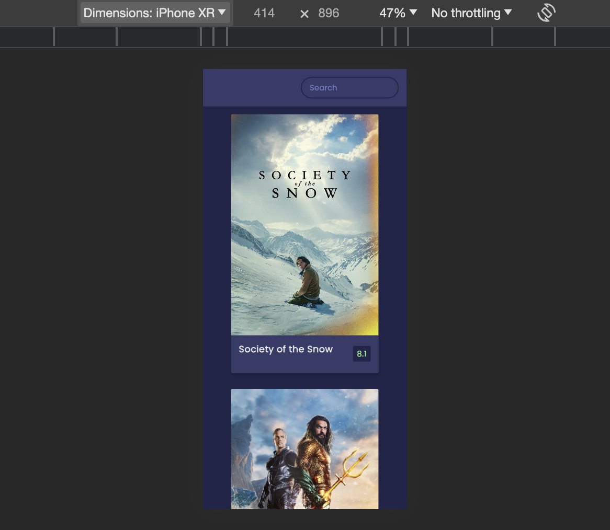

# Movie App using the Movie Database API 

It involves creating a responsive movie website using HTML, CSS and Javascript while using the movie database API.

## Table of contents

- [Overview](#overview)
  - [The challenge](#the-challenge)
  - [Screenshot](#screenshot)
  - [Links](#links)
- [My process](#my-process)
  - [Built with](#built-with)
  - [What I learned](#what-i-learned)
  - [Continued development](#continued-development)
  - [Useful resources](#useful-resources)
- [Author](#author)
- [Acknowledgments](#acknowledgments)


## Overview

### The challenge

The challenge involves creating a responsive movie website using HTML, CSS and Javascript while using the movie database API.

### Screenshot

The screenshot below shows the desktop design:


The screenshot below shows the mobile design:



### Links

- Solution URL: [Add solution URL here](https://github.com/richard9809/movie-app)
- Live Site URL: [Add live site URL here](https://friendly-kleicha-a5844e.netlify.app)

## My process

### Built with

- Semantic HTML5 markup
- CSS custom properties
- Flexbox
- Mobile-first workflow
- Javascript
- The Movie Database API


### What I learned

During this project, I learned how to integrate the movie database API using vanilla Javascript as shown below.

```js
const API_URL =
  "https://api.themoviedb.org/3/discover/movie?sort_by=popularity.desc&api_key=3fd2be6f0c70a2a598f084ddfb75487c&page=1";
const IMG_PATH = "https://image.tmdb.org/t/p/w1280";
const SEARCH_API =
  'https://api.themoviedb.org/3/search/movie?api_key=3fd2be6f0c70a2a598f084ddfb75487c&query="';
```

I also learnt how to implement asynchronous functions to get data from APIs.

```js
async function getMovies(url) {
  const res = await fetch(url);
  const data = await res.json();

  showMovies(data.results);
}
```

I also learnt how to create variables in css in order to reuse in the different elements in the css file.

```css
:root {
  --primary-color: #22254b;
  --secondary-color: #373b69;
}

body {
  background-color: var(--primary-color);
  font-family: 'Poppins', sans-serif;
  margin: 0;
}
```

I learnt how to implement transition and transformation using css.

```css
.overview {
  background-color: #fff;
  padding: 2rem;
  position: absolute;
  left: 0;
  bottom: 0;
  right: 0;
  max-height: 100%;
  transform: translateY(101%);
  overflow-y: auto;
  transition: transform 0.3s ease-in;
}

.movie:hover .overview {
  transform: translateY(0);
}
```

### Continued development

I plan to continue refining my skills in creating responsive designs and enhancing user interactions with more advanced CSS features.


### Useful resources

- [MDN Web Docs](https://developer.mozilla.org/en-US/) - An excellent resource for HTML, CSS, and JavaScript documentation.

- [The Movie Database](https://developer.themoviedb.org/reference/intro/getting-started) - This is an amazing article which helped me finally understand XYZ. I'd recommend it to anyone still learning this concept.

## Author

- Frontend Mentor - [@richard9809](https://www.frontendmentor.io/profile/richard9809)
- Twitter - [@rmulu333](https://www.twitter.com/rmulu333)

## Acknowledgments

I'd like to acknowledge the helpful resources and support from the the Movie Database. This project allowed me to practice and improve my web development skills.

